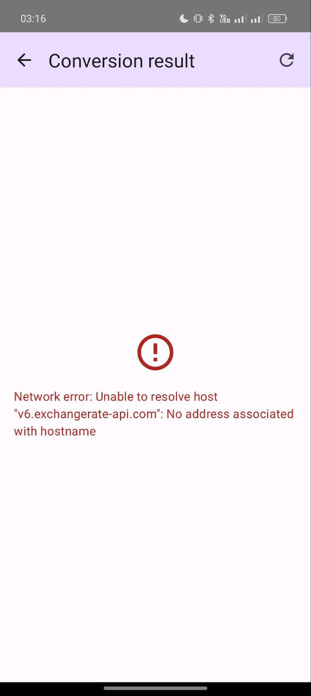

Это тестовое задание представляет собой небольшое приложение для конвертации валют. Приложение состоит из двух экранов: экрана выбора валют и ввода суммы и экрана с результатом конвертации.

В приложении используется API https://www.exchangerate-api.com/ для получения курсов валют.

Также используются следующие технологии:
- Retrofit
- RxJava3(Использовалась RxJava а не coroutines, так как в описании вакансии указан навык RxJava. При необходимости могу пользоваться coroutines)
- Jetpack Compose

Приложение соответствует архитектурному подходу MVVM.

Начальный экран с выбором валют:

Экран с результатом конвертации:

Обработка ошибки сети:

Также в приложении поддерживается темная тема.

Имеется возможность перезагружать результаты, чтобы запросить актуальную информацию о курсе валюты.

Также можно было добавить кэширование некоторых запросов, чтобы уменьшить количество сетевых вызовов, но у меня не хватило на это времени.